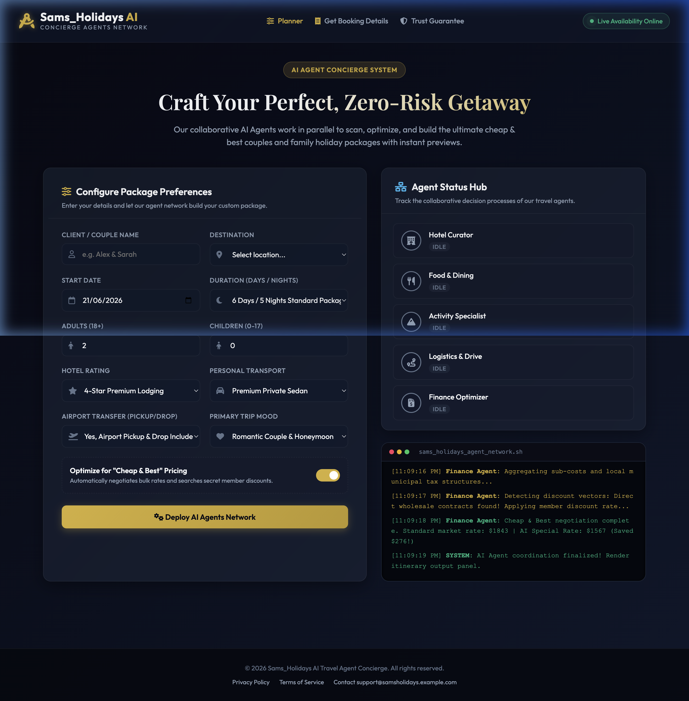
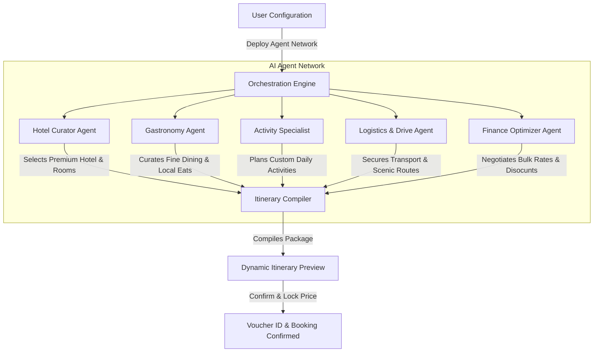

# Sams_Holidays AI — Premium Agentic Travel Concierge 🗺️✨

[](https://opensource.org/licenses/MIT)
[](https://samsul7718.github.io/Sams_Holidays-AI/)
[](https://sams-holidays-ai-691977289511.us-central1.run.app)



**Sams_Holidays AI** is a premium, client-facing agentic travel concierge web application. It orchestrates a collaborative network of five dedicated AI agents to design, optimize, and finalize custom, risk-free couple and family vacation packages at wholesale rates with instant booking capabilities.

---

## 🌟 Visual Workflow: Multi-Agent Orchestration

The application uses an event-driven status hub to simulate parallel collaboration across a network of five specialist AI agents. Below is the workflow diagram showcasing the orchestration pattern:



---

## 🚀 Key Features

* **Premium Glassmorphic UI/UX**: Outfitted with responsive layouts, Outfit/Playfair typography, sleek gold/cyan gradients, and subtle micro-animations.
* **5-Agent Collaborative Simulation**:
  1. **Hotel Curator**: Selects luxury or boutique properties matching user star ratings.
  2. **Food & Dining**: Recommends authentic culinary experiences and candlelight dinners.
  3. **Activity Specialist**: Plans personalized itineraries aligned with the trip mood (Romantic, Adventure, Relaxation, Cultural).
  4. **Logistics & Chauffeur**: Arranges transport (Convertibles, SUVs, Sedans) and programs custom scenic road trips.
  5. **Finance Optimizer**: Auto-applies wholesale pricing, details exact price lines, and highlights user savings.
* **Terminal Stream Log Console**: A real-time scrolling logger that mimics backend shell executions (`sams_holidays_agent_network.sh`) for rich transparency.
* **Interactive Day-by-Day Itineraries**: Dynamically formats time slots, locations, and descriptions on an active timeline with visual card previews.
* **0-Risk Booking Trust Guarantee**: Includes 24h free cancellation, direct-to-hotel payments, and immediate temporary Voucher ID creation.
* **Saved Bookings Panel**: Fully functional storage sync (LocalStorage) to pull up and review previously secured vouchers at any time.

---

## 🛠️ Technology Stack

* **Frontend**: Pure HTML5 (Semantic elements) and CSS3 (Custom design tokens, variables, flexbox/grid, and transitions).
* **Interactivity**: Modern Vanilla JavaScript (State management, local storage, dynamic DOM builders).
* **Icons**: [Font Awesome v6.4.0](https://cdnjs.cloudflare.com/ajax/libs/font-awesome/6.4.0/css/all.min.css)
* **Fonts**: [Google Fonts (Outfit & Playfair Display)](https://fonts.google.com/specimen/Outfit)

---

## 🏃 Local Run Instructions

No build process or installation is required. Since this is a static site:

1. **Clone the repository**:
   ```bash
   git clone https://github.com/Samsul7718/Sams_Holidays-AI.git
   cd Sams_Holidays-AI
   ```
2. **Launch locally**:
   - Double-click `index.html` to open directly in your web browser.
   - Alternatively, serve it using any simple local server (e.g. `npx serve` or Python's `python3 -m http.server 8080`).

---

## 🌐 Live Deployments

| Platform | URL | Status |
|---|---|---|
| **Google Cloud Run** | [https://sams-holidays-ai-691977289511.us-central1.run.app](https://sams-holidays-ai-691977289511.us-central1.run.app) | ✅ Live |
| **GitHub Pages** | [https://samsul7718.github.io/Sams_Holidays-AI/](https://samsul7718.github.io/Sams_Holidays-AI/) | ✅ Live |
